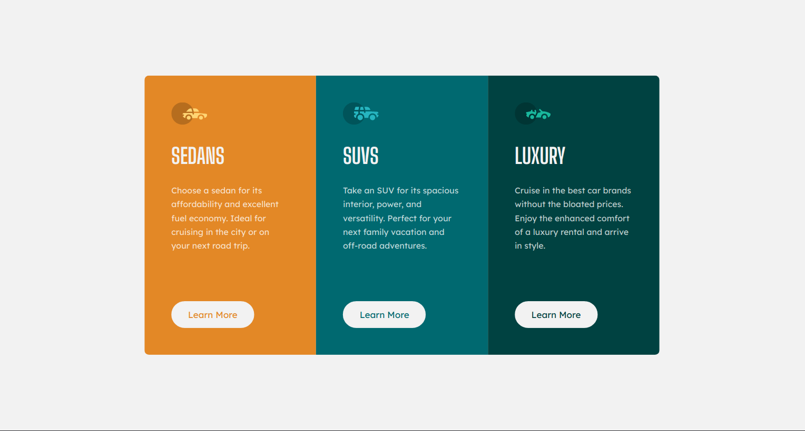

# Frontend Mentor - 3-column preview card component solution

This is a solution to the [3-column preview card component challenge on Frontend Mentor](https://www.frontendmentor.io/challenges/3column-preview-card-component-pH92eAR2-). Frontend Mentor challenges help you improve your coding skills by building realistic projects.

## Table of contents

- [Overview](#overview)
  - [The challenge](#the-challenge)
  - [Screenshot](#screenshot)
  - [Links](#links)
- [My process](#my-process)
  - [Built with](#built-with)
  - [What I learned](#what-i-learned)
  - [Continued development](#continued-development)
  - [Useful resources](#useful-resources)
- [Author](#author)
- [Acknowledgments](#acknowledgments)

## Overview

### The challenge

Create a responsive 3-column card that stacks on smaller screens.
Users should be able to:

- View the optimal layout depending on their device's screen size
- See hover states for interactive elements

### Screenshot

### Links

- Solution URL: [Add solution URL here](https://your-solution-url.com)
- Live Site URL: [Add live site URL here](https://your-live-site-url.com)

## My process

First I came up with a proper HTML structure that's both semantic and provides easy styling hooks for CSS.  
Afterwards I started with the CSS - did the necessary resets and base styles + all the necessary variables
from the style guide.  
Then I built the layout - since I decided to go with Heydon Pickering's [Flexbox Albatross](http://www.heydonworks.com/article/the-flexbox-holy-albatross) solution which disposes of media queries and allows for an ad-hoc _container query_ solution, I did both the mobile and desktop layout together.  
After that I went with a top-down approach - styling columns and their elements + the SVG icon, and tweaking the spacing at
the end.  
Lastly, I did the interactive link styles for the call-to-action links.

### Built with

- Semantic HTML5 markup
- CSS custom properties
- Flexbox
- CSS Grid
- Mobile-first workflow

### What I learned

Building a responsive CSS solution without media queries was a valuable experience. Embedding SVGs into `::before `pseudo-elements was also a useful practice. I spent quite a lot of time calculating line heights, `em` & `rem` sizes to tweak the spacing.

### Continued development

I plan to continue gaining working _intuition_ for both **flex** an **grid** layouts, their sizing, how their defaults
work etc. Since *container queries* are gaining traction & buzz, and will soon get implemented in browsers - it's probably worth researching them. I definitely see why and how they provide better solutions for components than media queries.

### Useful resources

- [Flexbox Holly Albatross](http://www.heydonworks.com/article/the-flexbox-holy-albatross) by [Heydon Pickering](https://heydonworks.com/)- This provided me with an ingenious solution for simulating a _container query_ by defining a `--threshold` variable on the container.

## Author

- Frontend Mentor - [@marisudris](https://www.frontendmentor.io/profile/marisudris)
- GitHub - [@marisudris](https://www.github.com/marisudris)

## Acknowledgments

Shout out to [Heydon Pickering](https://heydonworks.com/) and [Andy Bell](https://piccalil.li/) and their awesome book [Every Layout](https://every-layout.dev/) on CSS layouts. It really helps me gain systematic knowledge of CSS layout patterns, which in turn help me untangle & split these challenges into smaller problems.
